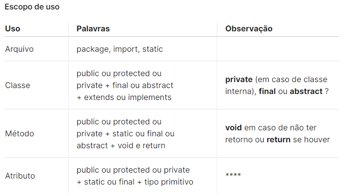
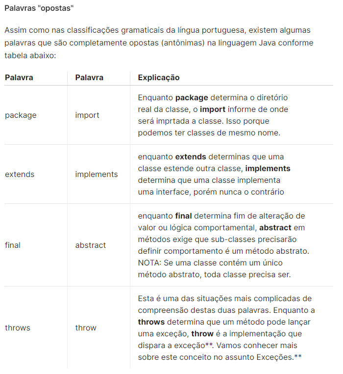

# PALAVRAS RESERVADAS!

## Lista de palavras reservadas da linguagem JAVA. 🙇‍♂️👨‍💻

### Controle de pacotes:

👉 import: importa pacotes ou classes para dentro do código

👉 package: especifica a que pacote todas as classes de um arquivo pertencem

### Modificadores de acesso:

👉 public: acesso de qualquer classe

👉 private: acesso apenas dentro da classe

👉 protected: acesso por classes no mesmo pacote e subclasses

### Primitivos:

👉boolean: um valor indicando verdadeiro ou falso

👉 byte: um inteiro de 8 bits (signed)

👉 char: um character unicode (16-bit unsigned)

👉 double: um número de ponto flutuante de 64 bits (signed)

👉 float: um número de ponto flutuante de 32 bits (signed)

👉 int: um inteiro de 32 bits (signed)

👉 long: um inteiro de 64 bits (signed)

👉 short: um inteiro de 32 bits (signed)

👉 void: indica que o método não tem retorno de valor

### Modificadores de classes, variáveis ou métodos:

👉 abstract: classe que não pode ser instanciada ou método que precisa ser implementado por uma subclasse não abstrata

👉 class: especifica uma classe

👉 extends: indica a superclasse que a subclasse está estendendo

👉 final: impossibilita que uma classe seja estendida, que um método seja sobrescrito ou que uma variável seja reinicializada

👉 implements: indica as interfaces que uma classe irá implementar

👉 interface: especifica uma interface

👉 native: indica que um método está escrito em uma linguagem dependente de plataforma, como o C

👉 new: instancia um novo objeto, chamando seu construtor

👉 static: faz um método ou variável pertencer à classe ao invés de às instâncias

👉 strictfp: usado em frente a um método ou classe para indicar que os números de ponto flutuante seguirão as regras de ponto flutuante em todas as expressões

👉 synchronized: indica que um método só pode ser acessado por uma thread de cada vez

👉 transient: impede a serialização de campos

👉 volatile: indica que uma variável pode ser alterada durante o uso de threads

### Controle de fluxo dentro de um bloco de código:

👉 break: sai do bloco de codigo em que ele está

👉 case: executa um bloco de código dependendo do teste do switch

👉 continue: pula a execução do código que viria após essa linha e vai para a próxima passagem do loop

👉 default: executa esse bloco de codigo caso nenhum dos teste de switch-case seja verdadeiro

👉 do: executa um bloco de código uma vez, e então realiza um teste em conjunto com o while para determinar se o bloco deverá ser executado novamente

👉 else: executa um bloco de código alternativo caso o teste if seja falso

👉 for: usado para realizar um loop condicional de um bloco de código

👉 if: usado para realizar um teste lógico de verdadeiro o falso

👉 instanceof: determina se um objeto é uma instância de determinada classe, superclasse ou interface

👉 return: retorna de um método sem executar qualquer código que venha depois desta linha (também pode retornar uma variável)

👉 switch: indica a variável a ser comparada nas expressões case

👉 while: executa um bloco de código repetidamente enquanto a condição for verdadeira

### Tratamento de erros:

👉 assert: testa uma expressão condicional para verificar uma suposição do programador

👉 catch: declara o bloco de código usado para tratar uma exceção

👉 finally: bloco de código, após um try-catch, que é executado independentemente do fluxo de programa seguido ao lidar com uma exceção

👉 throw:usado para passar uma exceção para o método que o chamou

👉 throws: indica que um método pode passar uma exceção para o método que o chamou

👉 try: bloco de código que tentará ser executado, mas que pode causar uma exceção

### Variáveis de referência:

👉 super: refere-se a superclasse imediata

👉 this: refere-se a instância atual do objeto

### Palavras reservadas não utilizadas:

👉 const: Não utilize para declarar constantes; use public static final

👉 goto: não implementada na linguagem Java por ser considerada prejudicial

## Tabela de escopos para cada palavra: 🤳✨

